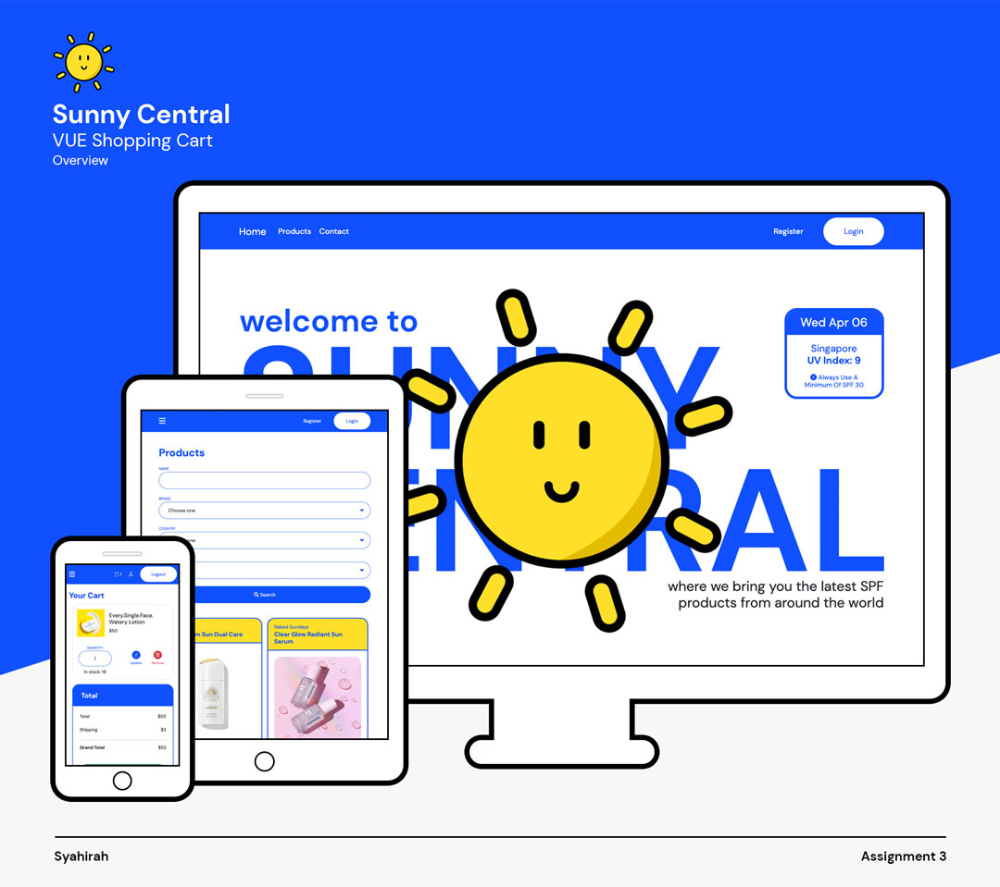
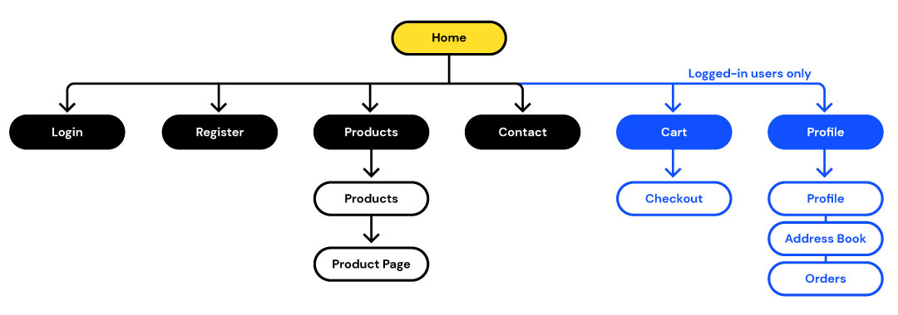

# Sunny Central

As a frequent user of parcel forwarders pre-covid(when shipping costs were not as high and overseas shipping options were not as limited), I found the whole process of purchasing products via that method a hassle. If the shop accepts international cards, I would be able able to purchase it myself. However, some retailers (like Ulta, Mecca) which are country-specific, do not, so I would have to engage a middle man. More often than not, I would think to myself how nice it would be to have a retailer selling various exclusive products in one place.

As with project 2, skincare is a big passion of mine. Having followed lots of up-and-coming skincare brands on social media, I'm always envious of the people who live in those countries because they'll be able to purchase those products as soon as they land in stores. In Singapore(and everywhere else), we'll just have to wait and see if any major retailers decide to bring them in locally.

And with that in mind, I have come up with Sunny Central, a third-party retailer who brings in exclusive and not-so-accessible SPF products from all over the world to local customers.

**As the end user, I want to:**
- easily shop new sunscreens
- discover sunscreens from other brands or countries

Visit the Sunny Central store [here](https://gleeful-tanuki-c97887.netlify.app/)!
And take a peak at the admin portal [here](https://nsy-03-sunscreen.herokuapp.com/login).

You may register or log in using this account:
> **username:** lindaa   **password** 12345678

# UI/UX

[Here's](https://www.figma.com/file/QsHGWWdaYlQrsi3Zb0LeO0/sunny-central?node-id=0%3A1) the wireframes for the front & back end.

The chosen colours are very self-explanatory – blue for the sky & sea and yellow for the sun. The font used, [DM Sans](https://fonts.google.com/specimen/DM+Sans), is a visually fun typeface.

The sunny face greets you upon landing and the hourly Singapore UV index is displayed on the right.

# Features
1. Register an account
2. Log in & out
3. Add products to cart (only if you are signed in)
4. Purchase products and pay via Stripe
5. View past orders in profile page
6. Update profile & address information

# Technologies Used
1. Figma – used to create wireframes
2. Illustrator to create some icons
3. Fontawesome & Bootstrap icons for the other icons
4. Vue – to set up the front end site
5. Vuex - store & update info
6. Vue Router – to have pages with URLs that correspond to the page name e.g "/products"
7. Netlify – used to host the Vue front end

# Use & Test Cases:
1. Register & Log In
2. Add product to cart
3. Checkout
4. View orders and edit profile, password
5. [No log in required] Send an enquiry

## Register & Log In
| Description | Expected Results |
| ----------- | ---------------- |
| Click on the Register link at the top right | Form will be displayed |
| Fill in all fields | If there are any errors or fields are left empty, the appropriate validation messages will appear |
| Once done, click on "Register" | User will be added to the database and redirected to the login page |
| Fill in the username & password fields and click log in | If user is found in database, they will be logged in and the profile page will apear.    If not, an error message will appear. |

## Add product to cart & View cart
| Description | Expected Results |
| ----------- | ---------------- |
| Go to the products page | List of sunsreens will appear |
| Use search form to filter through products | Name field is not case sensitive |
| Directly add cart to product from products page | The number of items in cart at the top left will only be updated if product stock is more than 0    If not signed in, user will be prompted to log in or register |
| Click on the product to view individual detailed page | User is able to choose how many they want to add to cart, not exceeding the min and max stock |
| Go to the cart page by clicking on the cart icon at the top right | If cart is empty, the "Your cart is empty" message will show up. Otherwise, user can update quantity and remove products from cart |
| Upon updating or deleting products, messages will appear to alert them of the status. | The subtotal and total on the right will be automatically updated |

## Checkout
| Description | Expected Results |
| ----------- | ---------------- |
| Once satisfied with the products in the cart, click on "Proceed to payment" | User will be directed to a payment page on Stripe |
| Use any dummy card from [this list](https://stripe.com/docs/testing) to test payment. Click on "Pay" | Pay button will load and turn green if payment is successufl |
| User will be directed to the checkout success page | A summary of the order will be displayed |

## Profile – view/update details & orders
| Description | Expected Results |
| ----------- | ---------------- |
| Click on the user icon at the top right | Lead to the profile page, with profile, address & orders collapsed into separate tabs |
| Click on the Edit button for profile, password or address | Appropriate error messages will appear if there are any error/invalid input |
| Once done, click Update | Upon updating, changes will be reflected on profile page |
| Click on the orders tab to view orders from newest to olders | If shop admin has updated a tracking URL, it will appear with an icon. User can click to view tracking |

## [No log in required] Send an enquiry
| Description | Expected Results |
| ----------- | ---------------- |
| Click on the Contact link on the navbar | User will see a contact us form |
| Fill in all fields, select a reason so shop owner can filter through more easily | Error messages will appear accordingly if there are any error/invalid input |
| Click Submit | Shop owner will see your enquiry on the admin portal and will reply via email |

# This site has been tested on:

# Credits
1. [Fontawesome](https://fontawesome.com/)
2. [Bootstrap Icons](https://icons.getbootstrap.com/)
3. [Stack Overflow](https://stackoverflow.com/)
4. [Singapore UV Index – NEA, Data.gov.sg](https://data.gov.sg/dataset/ultraviolet-index-uvi)